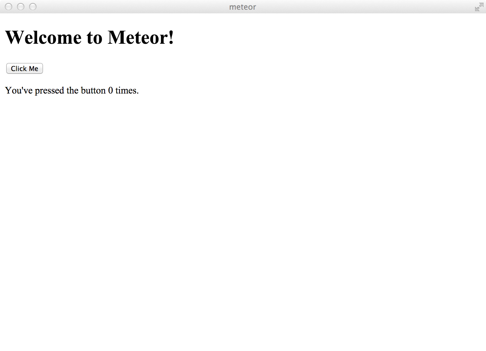

# Meteor/Atom based Desktop App

## Quickstart
- clone this repository `git clone https://github.com/sigmeus/meteor-desktop-app.git`
- Install any version of Node.js
- Install meteor.js `curl https://install.meteor.com/ | sh`.
- Optional: link your app to ./meteor folder

### Running the development Server
- start your meteor app `cd meteor & meteor`
- `./script/run.sh`

## Creators
- mainly reusing components of the awesome [KITEMATIC](https://github.com/kitematic/kitematic) app
- fix

## TODO
- make as meteor package

## Copyright and License

Code released under the [AGPL license](LICENSE).
